# database_repository created by <I>Wiselnn</I>
<span></span>
<span><span>

DataBase course of SCU 魏熙林 2019141410450

<details>
<summary>Homework1</summary>
<h2>Homework1</h2>

```sql
--Q1 Get all unique ShipNames from the Order table that contain a hyphen '-'.
--Details: In addition, get all the characters preceding the (first) hyphen. Return ship 
--names alphabetically. Your first row should look like Bottom-Dollar Markets|Bottom

SELECT DISTINCT ShipName || '|' || substr(ShipName, 1, instr(ShipName, '-')-1)
AS Q1_ANSWER
FROM 'Order'
WHERE ShipName LIKE '%-%'
ORDER BY ShipName;
```

Result:
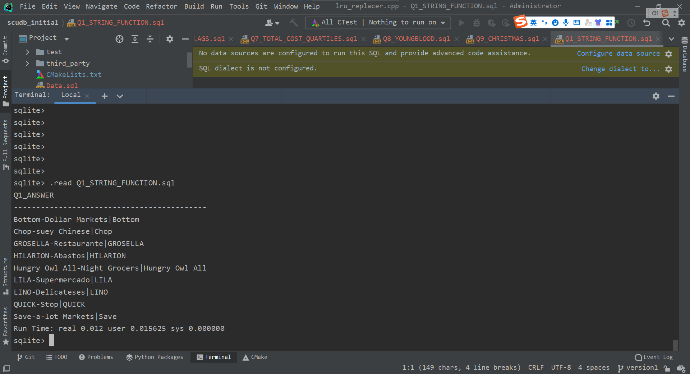

```sql
--Q2 Indicate if an order's ShipCountry is in North America. For our purposes, this 
--is 'USA', 'Mexico', 'Canada'
--Details: You should print the Order Id, ShipCountry, and another column that is 
--either 'NorthAmerica' or 'OtherPlace' depending on the Ship Country.
--Order by the primary key (Id) ascending and return 20 rows starting from Order 
--Id 15445 Your output should look 
--like 15445|France|OtherPlace or 15454|Canada|NorthAmerica

SELECT Id || '|' || ShipCountry || '|' || (case WHEN ShipCountry IN ('USA','Mexico','Canada') THEN "NorthAmerica" ELSE "OtherPlace" END)
AS Q2_ANSWER
FROM "Order"
WHERE Id>=15445
LIMIT 20;
```

Result:
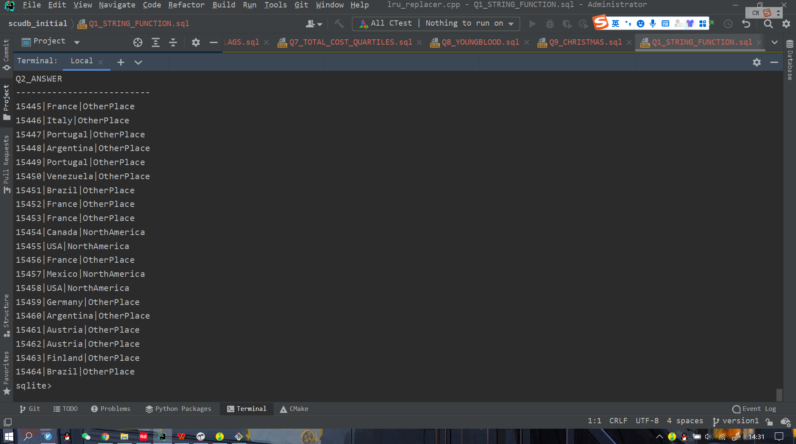

```sql
--Q3 For each Shipper, find the percentage of orders which are late.
--Details: An order is considered late if ShippedDate > RequiredDate. Print the 
--following format, order by descending precentage, rounded to the nearest 
--hundredths, like United Package|23.44

SELECT ComPanyName || '|' || printf("%.2f",COUNT(CASE WHEN ShippedDate>RequiredDate THEN 1 ELSE null END) * 100 / ROUND(COUNT('Order'.Id)))
AS Q3_ANSWER
FROM 'Order', Shipper
WHERE 'Order'.ShipVia = Shipper.Id
GROUP BY Shipper.Id
ORDER BY COUNT(CASE WHEN ShippedDate>RequiredDate THEN 1 ELSE null END) * 100 / ROUND(COUNT('Order'.Id)) DESC;
```

Result:
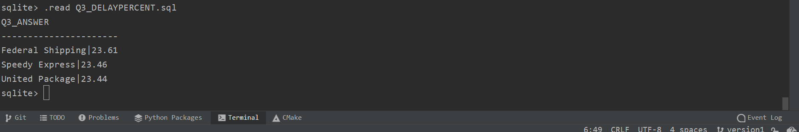

```sql
--Q4 Compute some statistics about categories of products
--Details: Get the number of products, average unit price (rounded to 2 decimal 
--places), minimum unit price, maximum unit price, and total units on order for 
--categories containing greater than 10 products.
--Order by Category Id. Your output should look like Beverages|12|37.98|4.5|263.5|60

SELECT CategoryName ||'|'||COUNT(CategoryName)||'|'||ROUND(AVG(UnitPrice), 2)||'|'||MIN(UnitPrice)||'|'||MAX(UnitPrice)||'|'||SUM(UnitsOnOrder)
AS Q4_ANSWER
FROM Product, Category
WHERE Product.CategoryId=Category.Id
GROUP BY Category.Id
HAVING COUNT(*) > 10
ORDER BY Category.Id;
```

Result:
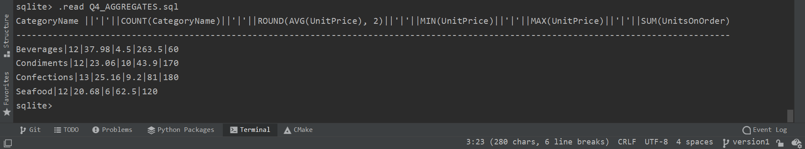

```sql
--Q5 [10 POINTS] (Q5_DISCONTINUED):
--For each of the 8 discontinued products in the database, which customer made the 
--first ever order for the product? Output the 
--customer's CompanyName and ContactName
--Details: Print the following format, order by ProductName alphabetically: Alice
--Mutton|Consolidated Holdings|Elizabeth Brown

SELECT ProductName||"|"||CompanyName||"|"||ContactName
AS Q5_ANSWER
FROM (SELECT * FROM "Order"
      LEFT OUTER JOIN OrderDetail ON "Order".Id=OrderId
      LEFT OUTER JOIN Customer ON CustomerId=Customer.Id
      LEFT OUTER JOIN Product ON ProductId=Product.Id
      WHERE Discontinued = 1
      ORDER BY orderDate)
GROUP BY ProductId
ORDER BY ProductName;
```

Result:
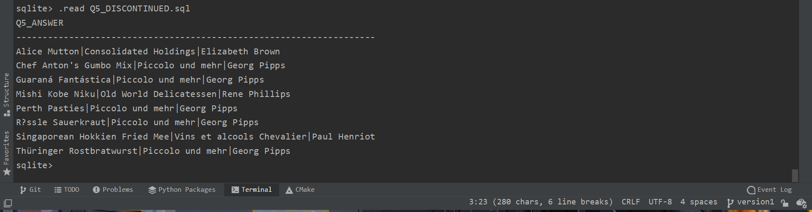

```sql
--Q6 [10 POINTS] (Q6_ORDER_LAGS):
--For the first 10 orders by CutomerId BLONP: get the Order's Id, OrderDate, 
--previous OrderDate, and difference between the previous and current. Return 
--results ordered by OrderDate (ascending)
--Details: The "previous" OrderDate for the first order should default to itself (lag 
--time = 0). Use the julianday() function for date arithmetic (example).
--Use lag(expr, offset, default) for grabbing previous dates.
--Please round the lag time to the nearest hundredth, formatted like 17361|2012-09-
--19 12:13:21|2012-09-18 22:37:15|0.57\

SELECT Id||"|"||OrderDate||"|"||(LAG(OrderDate,1, OrderDate) OVER(ORDER BY OrderDate))||"|"||
ROUND(julianday(OrderDate)-julianday(LAG(OrderDate,1, OrderDate) OVER(ORDER BY OrderDate)),2)
AS Q6_ANSWER
FROM 'Order'
WHERE CustomerId="BLONP"
ORDER BY OrderDate
LIMIT 10;
```

Result:
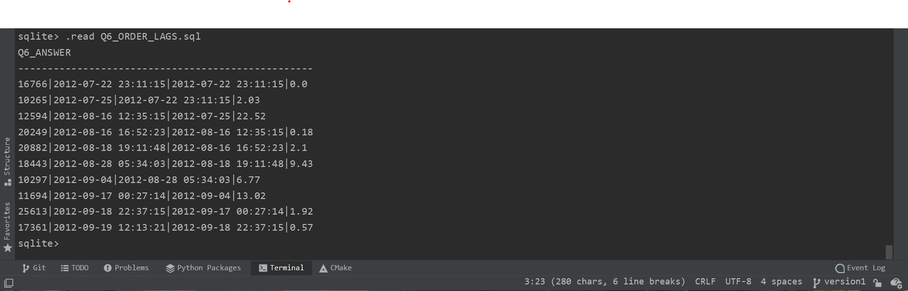

```sql
--Q7 [15 POINTS] (Q7_TOTAL_COST_QUARTILES):
--For each Customer, get the CompanyName, CustomerId, and "total expenditures". 
--Output the bottom quartile of Customers, as measured by total expenditures.
--Details: Calculate expenditure using UnitPrice and Quantity (ignore Discount). 
--Compute the quartiles for each company's total expenditures using NTILE. The 
--bottom quartile is the 1st quartile, order them by increasing expenditure.
--Make sure your output is formatted as follows (round expenditure to nearest 
--hundredths): Bon app|BONAP|4485708.49
--Note: There are orders for CustomerIds that don't appear in the Customer table. 
--You should still consider these "Customers" and output them. If 
--the CompanyName is missing, override the NULL to 'MISSING_NAME' using IFNULL.

SELECT CompanyName || '|' || CustomerId || '|' || ROUND(total, 2)
AS Q7_ANSWER
FROM (SELECT IFNULL(CompanyName, "MISSING_NAME") AS CompanyName, CustomerId, total, NTILE(4) OVER(ORDER BY CAST(total AS float)) AS quartile
    FROM
    (
        (SELECT 'Order'.CustomerId, SUM(UnitPrice*Quantity) AS total
            FROM 'Order'
            LEFT OUTER JOIN OrderDetail ON 'Order'.Id=OrderDetail.OrderId
            GROUP BY 'Order'.CustomerId)
        LEFT OUTER JOIN Customer ON CustomerId=Customer.Id
    )
)
WHERE quartile=1
ORDER BY CAST(total AS float);
```

Result:
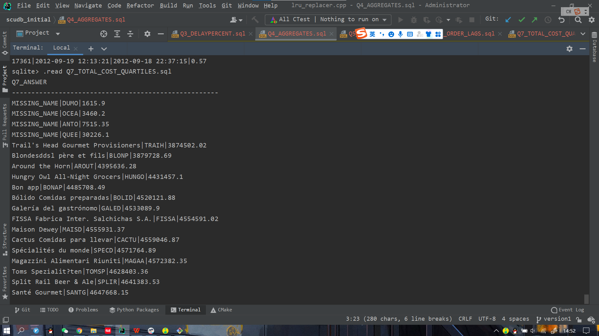
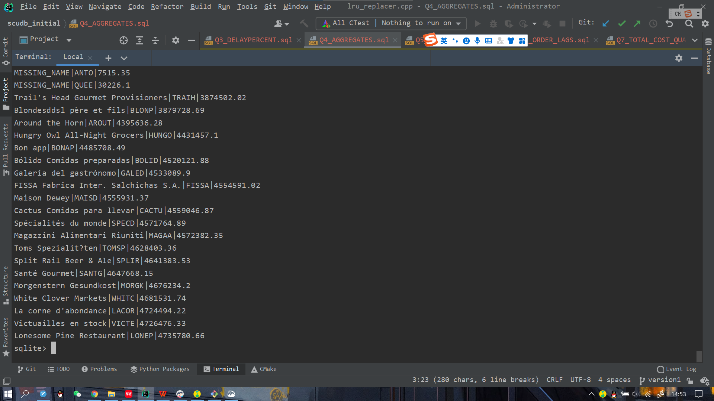
```sql
--Q8 [15 POINTS] (Q8_YOUNGBLOOD):
--Find the youngest employee serving each Region. If a Region is not served by an 
--employee, ignore it.
--Details: Print the Region Description, First Name, Last Name, and Birth Date. 
--Order by Region Id.
--Your first row should look like Eastern|Steven|Buchanan|1987-03-04

SELECT RegionDescription||'|'||FirstName||'|'||LastName||'|'||BirthDate
AS Q8_ANSWER
FROM
(SELECT *
    FROM Employee
    LEFT OUTER JOIN EmployeeTerritory ON EmployeeId=Employee.Id
    LEFT OUTER JOIN Territory ON TerritoryId=Territory.Id
    LEFT OUTER JOIN Region ON RegionId=Region.Id
    ORDER BY BirthDate DESC)
GROUP BY RegionId
ORDER BY RegionId;
```

Result:
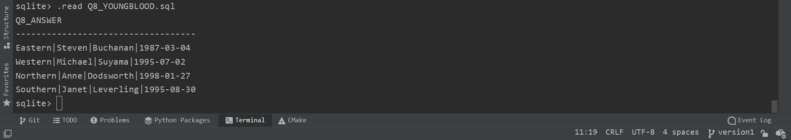

```sql
--Q9 [15 POINTS] (Q9_CHRISTMAS):
--Concatenate the ProductNames ordered by the Company 'Queen
--Cozinha' on 2014-12-25.
--Details: Order the products by Id (ascending). Print a single string
--containing all the dup names separated by commas like Mishi Kobe
--Niku, NuNuCa Nuß-Nougat-Creme...
--Hint: You might find Recursive CTEs useful.

SELECT GROUP_CONCAT(ProductName,", ") AS Q9_ANWSER
FROM 'Order'
         LEFT OUTER JOIN OrderDetail ON "Order".Id = OrderDetail.OrderId
         LEFT OUTER JOIN Product ON OrderDetail.ProductId = Product.Id
         LEFT OUTER JOIN Customer ON "Order".CustomerId = Customer.Id
WHERE Customer.CompanyName = 'Queen Cozinha' AND 'Order'.OrderDate LIKE '2014-12-25 __:__:__';
```

Result:
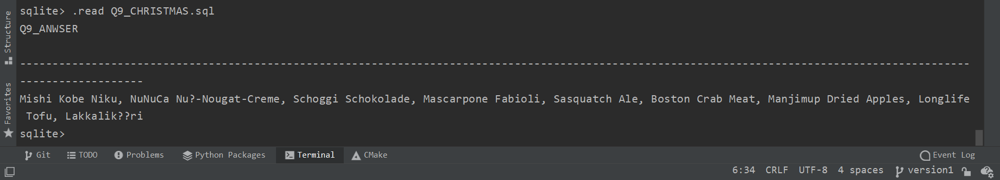
</details>

<details>
<summary>Homework2</summary>

## Homework2

### extendible_hash_test passed

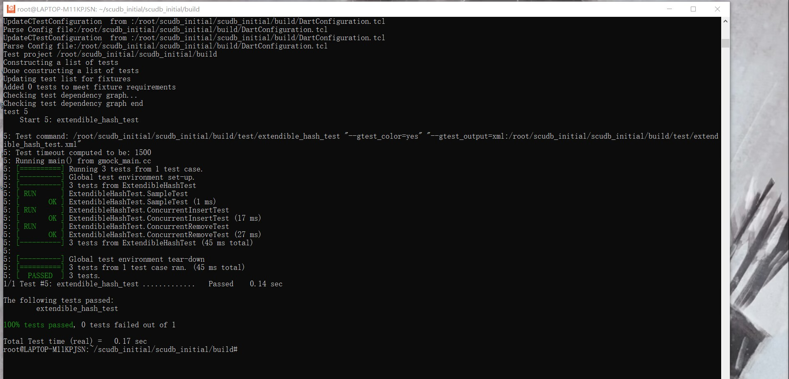

### lru_replacer_test passed

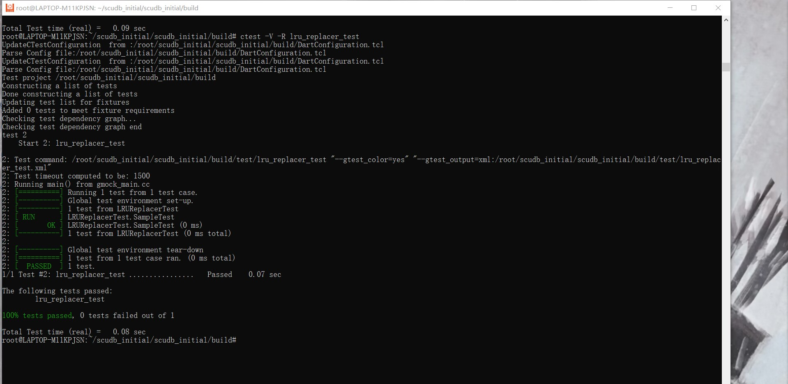

### buffer_pool_manager_test passed

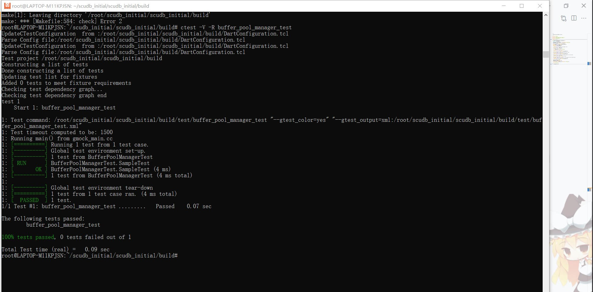
</details>

<details>
<summary>Homework3</summary>

## Homework3

### b_plus_tree_print_test passed

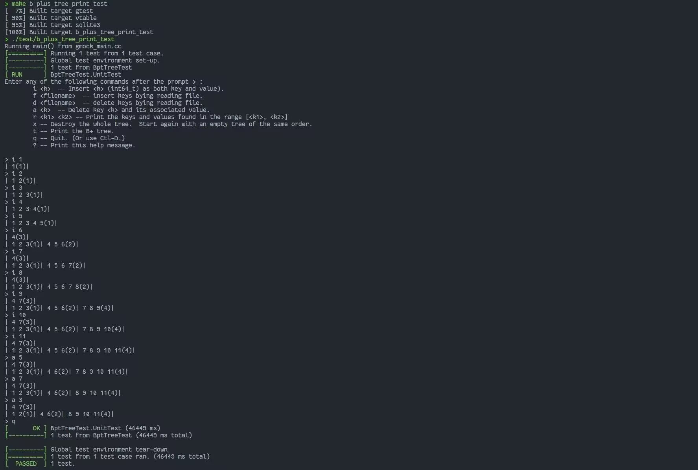

### b_plus_tree_test passed

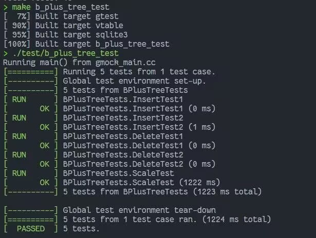

### bptTreeTest_unitTest passed

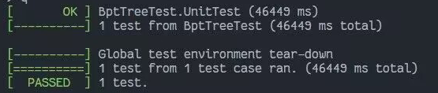
</details>
